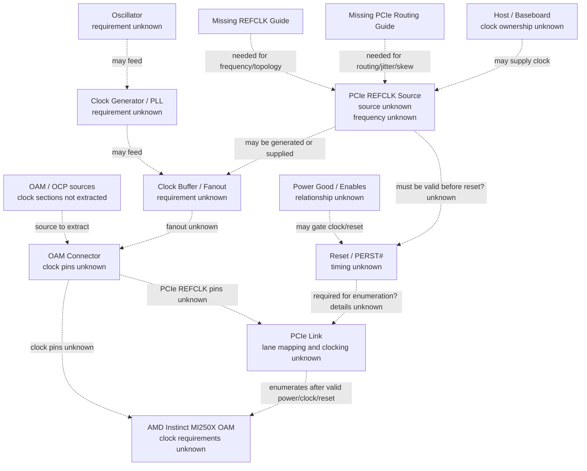

# Clock Tree

# Purpose

Document every clock-related reference found in the repository for the AMD Instinct MI250X OAM carrier effort, including PCIe REFCLK, oscillators, clock generators, PLLs, clock buffers, fanout, routing, frequency, jitter, skew, synchronization, and reset interaction. Unknown values remain unknown.

| Label | Statement | Sources |
|---|---|---|
| Verified | The project requires undocumented hardware behavior to be tracked instead of assumed. | `README.md`; `AI_PROJECT_CONTEXT.md`; `AI_TASKS.md` |
| Verified | The current readable repository does not contain a verified MI250X OAM REFCLK frequency, clock source, clock topology, clock-generator part number, oscillator part number, PLL requirement, clock-buffer part number, fanout count, jitter budget, skew budget, routing rule, or reset-clock timing value. | `Wanted_Documents.md`; `17_System_Architecture/03_Minimal_Carrier_Requirements.md`; `18_Component_Research/03_Clock_Generators.md` |
| Inferred | This file is a requirements-discovery reference and dependency map, not a schematic clock tree, routing guide, or component recommendation. | `09_AI_Notes/10_Design_Checklist.md`; `15_Reverse_Engineering/10_Minimal_Carrier.md`; `18_Component_Research/03_Clock_Generators.md` |

# Verified

## Source Review

| Source area | Source status | Clock-related evidence found | Limitations | Sources |
|---|---|---|---|---|
| AMD / ROCm readable notes | Readable local notes exist. | MI210 is described as a standard PCIe 4.0 x16 card, and MI200 SDMA engines are described as tuned for PCIe 4.0 x16. | This is software/data-movement context and does not define MI250X OAM REFCLK frequency, topology, jitter, skew, routing, or reset timing. | `13_Reference_Docs/ROCm/Overview.md`; `15_Reverse_Engineering/05_PCIe.md`; `18_Component_Research/08_PCIe_Retimers.md` |
| AMD indexed references | Indexed only. | CDNA whitepapers, Hot Chips 34, MI200 Datasheet, MI210 Product Brief, MI200 ISA, MI250 Architecture, MI250 Acceptance, Health Checks, System Validation, AMD Lab Notes, Matrix Core Notes, and MI200 Memory Space are named in the reference index. | The index does not include extracted carrier clock requirements. | `13_Reference_Docs/Reference_Index.rtf`; `13_Reference_Docs/README.md` |
| OCP / OAM references | Indexed or linked. | OAM Specification is tracked, and OAM Base Spec, OCP Accelerator Spec, Universal Baseboard, and OAI EXP are indexed. | OAM clock-interface sections, if any, are not extracted into readable local files. | `02_AMD_Docs/GitHub_Links.rtf`; `13_Reference_Docs/Reference_Index.rtf`; `09_AI_Notes/02_OAM_Interface.md` |
| Wanted documents | Readable tracker. | REFCLK Guide and PCIe Routing Guide are marked missing. | The missing guides are the likely source for REFCLK and routing requirements, but they are not available locally. | `Wanted_Documents.md`; `09_AI_Notes/05_Clock_Architecture.md`; `15_Reverse_Engineering/05_PCIe.md` |
| Research paper notes | Readable note exists. | `Understanding Data Movement` notes list Infinity Fabric, MI250X, RCCL, MPI, node topology, bandwidth matrix, and MPI bandwidth. | These are topology/performance topics, not carrier REFCLK, oscillator, jitter, skew, or routing specifications. | `08_Research_Papers/01_Architecture/notes.rtf`; `15_Reverse_Engineering/05_PCIe.md` |
| Research PDFs | Unreadable locally. | `Understanding_Data_Movement.pdf` and `MI200_Memory_Space.pdf` could not be read. | They cannot support clock claims until repaired or replaced. | `08_Research_Papers/01_Architecture/Understanding_Data_Movement.pdf`; `13_Reference_Docs/ROCm/MI200_Memory_Space.pdf`; `09_AI_Notes/09_Unknowns.md` |
| Matrix core AMD notes | Readable local note exists. | The copied matrix-core article is summarized as containing `cycles` and `flops/clock/CU` table entries for MI250X. | This is compute-throughput terminology, not a carrier-board REFCLK or clock-tree requirement. | `13_Reference_Docs/ROCm/Matrix_Cores/README.md` |

## Carrier-Relevant Clock Mentions

| Clock mention | Status | Repository-supported statement | What remains unknown | Sources |
|---|---|---|---|---|
| PCIe REFCLK | Unknown | REFCLK Guide is marked missing, and PCIe research scope includes REFCLK. | Frequency, source, topology, electrical standard, spread-spectrum behavior, routing, connector pins, jitter, skew, and reset interaction. | `Wanted_Documents.md`; `15_Reverse_Engineering/05_PCIe.md`; `18_Component_Research/03_Clock_Generators.md` |
| Clock subsystem | Unknown | The system block diagram shows a Clock Subsystem connected to the OAM connector with REFCLK source, frequency, and topology undocumented. | Whether the clock is host-supplied, baseboard-supplied, carrier-generated, module-supplied, buffered, or fanned out. | `17_System_Architecture/02_System_Block_Diagram.md`; `15_Reverse_Engineering/09_Block_Diagram.md` |
| Clock source / REFCLK block | Unknown | The reverse-engineering block diagram includes a Clock Source block labeled `REFCLK etc.` and marks it unknown. | Actual clock source, net names, frequency, electrical standard, and routing constraints. | `15_Reverse_Engineering/09_Block_Diagram.md`; `17_System_Architecture/02_System_Block_Diagram.md` |
| Reference clock subsystem | Inferred | Minimal carrier requirements state that a carrier must provide whatever reference clocks are required by the host link and OAM interface once verified. | Exact clocks, source, topology, fanout, jitter budget, skew, termination, clock generator, buffer, and oscillator requirements. | `17_System_Architecture/03_Minimal_Carrier_Requirements.md`; `15_Reverse_Engineering/10_Minimal_Carrier.md` |
| Clock startup | Inferred | Bring-up notes list clock startup before reset release and PCIe enumeration as an inferred flow step. | Required clock-valid condition, timing, measurement point, dependency on Power Good, and reset-release relationship. | `15_Reverse_Engineering/08_Bringup.md`; `15_Reverse_Engineering/02_Power_Rails.md`; `18_Component_Research/03_Clock_Generators.md` |
| Reset-clock relationship | Unknown | Reset signals and reset-clock timing relationships are undocumented. | Reset signal names, release timing, required clock state before reset release, and Power Good relationship. | `15_Reverse_Engineering/08_Bringup.md`; `15_Reverse_Engineering/01_OAM_Pin_Mapping.md`; `15_Reverse_Engineering/05_PCIe.md` |
| Clock topology | Unknown | `AI_TASKS.md` lists clock topology as a current high-priority engineering unknown. | Topology, source ownership, fanout, buffers, oscillators, and validation criteria. | `AI_TASKS.md`; `09_AI_Notes/05_Clock_Architecture.md`; `18_Component_Research/03_Clock_Generators.md` |
| Reliable clock generation | Verified goal | System goals list reliable clock generation. | The goal does not define frequency, jitter, skew, topology, clock source, or components. | `17_System_Architecture/01_System_Goals.md`; `18_Component_Research/03_Clock_Generators.md` |

## Clock Component Mentions

No clock component is verified as selected, required, or present.

| Component or category | Manufacturer | Part number | Status | Repository-supported information | Unknowns | Sources |
|---|---|---|---|---|---|---|
| PCIe REFCLK source | Unknown | Unknown | Unknown category | A minimal carrier must provide whatever reference clocks are required once verified, and the REFCLK Guide is missing. | Source, frequency, topology, electrical standard, connector pins, and validation method. | `Wanted_Documents.md`; `17_System_Architecture/03_Minimal_Carrier_Requirements.md`; `18_Component_Research/03_Clock_Generators.md` |
| Oscillator | Unknown | Unknown | Unknown category | Oscillator research is part of clock-generator component scope, but no oscillator requirement is documented. | Manufacturer, part number, frequency, tolerance, output standard, supply rail, enable behavior, package, and placement. | `18_Component_Research/03_Clock_Generators.md`; `18_Component_Research/10_BOM.md`; `15_Reverse_Engineering/07_Component_ID.md` |
| Clock generator | Unknown | Unknown | Unknown category | Clock generators are listed as a component category to identify and as an unknown BOM category. | Manufacturer, part number, input source, output count, output standard, configuration method, power rail, and programming interface. | `15_Reverse_Engineering/07_Component_ID.md`; `18_Component_Research/03_Clock_Generators.md`; `18_Component_Research/10_BOM.md` |
| PLL | Unknown | Unknown | Unknown category | No readable local source documents a verified PLL requirement or PLL part number. | Whether a PLL is required, location, input/output frequencies, bandwidth, jitter behavior, and configuration method. | `18_Component_Research/03_Clock_Generators.md`; `18_Component_Research/10_BOM.md` |
| Clock buffer | Unknown | Unknown | Unknown category | Clock buffers are included in the clock-tree research scope and unknown BOM categories. | Requirement, fanout count, output standard, additive jitter, skew, enable behavior, topology, and part number. | `18_Component_Research/03_Clock_Generators.md`; `17_System_Architecture/03_Minimal_Carrier_Requirements.md`; `18_Component_Research/10_BOM.md` |
| PCIe switch / retimer clocking support | Unknown | Unknown | Unknown dependency | PCIe switch, retimer, and related clocking needs are undocumented; no readable source proves a switch or retimer is required. | Whether switch/retimer clocking exists, reference clock input, output fanout, jitter tolerance, management, reset, and sequencing. | `18_Component_Research/08_PCIe_Retimers.md`; `15_Reverse_Engineering/05_PCIe.md`; `17_System_Architecture/02_System_Block_Diagram.md` |

# Mermaid Clock Tree Diagram

This diagram is a dependency map only. Every clock edge is unresolved until REFCLK, OAM connector, baseboard, PCIe routing, and reset timing evidence is recovered. Sources: `17_System_Architecture/02_System_Block_Diagram.md`; `15_Reverse_Engineering/08_Bringup.md`; `18_Component_Research/03_Clock_Generators.md`.

# Inferred

| Inferred requirement | Evidence basis | What is not verified | Sources |
|---|---|---|---|
| PCIe REFCLK must be resolved before schematic capture. | REFCLK Guide and PCIe Routing Guide are missing, and design checklist requires PCIe/REFCLK constraints before schematic/layout. | Frequency, source, topology, electrical standard, routing, jitter, skew, and connector pins. | `Wanted_Documents.md`; `09_AI_Notes/10_Design_Checklist.md`; `15_Reverse_Engineering/05_PCIe.md` |
| A minimal carrier must account for required reference clocks once known. | Minimal carrier requirements list reference clock subsystem as required after verification. | Whether the carrier generates clocks, receives them from host/baseboard, buffers them, or only routes them. | `17_System_Architecture/03_Minimal_Carrier_Requirements.md`; `15_Reverse_Engineering/10_Minimal_Carrier.md` |
| Clock startup may precede reset release and PCIe enumeration. | Bring-up notes list clock startup before reset release and PCIe enumeration in an inferred flow. | Actual timing, signal names, voltage levels, Power Good dependency, and clock-valid criteria. | `15_Reverse_Engineering/08_Bringup.md`; `15_Reverse_Engineering/02_Power_Rails.md` |
| Clock component selection is premature. | Clock generators, oscillators, PLLs, and buffers are tracked as unknown categories with no verified part numbers. | Manufacturer, part number, package, outputs, fanout, jitter, skew, power rails, and programming method. | `15_Reverse_Engineering/07_Component_ID.md`; `18_Component_Research/03_Clock_Generators.md`; `18_Component_Research/10_BOM.md` |
| Multi-module clocking may need later fanout or synchronization research. | Future expansion documents target multiple MI250X modules, but topology is undocumented. | Fanout count, clock ownership, synchronization method, and scale-out topology. | `17_System_Architecture/04_Future_Expansion.md`; `17_System_Architecture/03_Minimal_Carrier_Requirements.md`; `18_Component_Research/03_Clock_Generators.md` |

# Unknown

## Unknown Clock Requirements

| Requested item | Status | Unknown values | Sources |
|---|---|---|---|
| PCIe REFCLK | Unknown | Frequency, source, topology, electrical standard, spread-spectrum rule, termination, AC-coupling, connector pins, and routing constraints. | `Wanted_Documents.md`; `15_Reverse_Engineering/05_PCIe.md`; `18_Component_Research/03_Clock_Generators.md` |
| Oscillators | Unknown | Requirement, manufacturer, part number, frequency, tolerance, output standard, supply rail, enable behavior, package, placement, and validation method. | `18_Component_Research/03_Clock_Generators.md`; `18_Component_Research/10_BOM.md` |
| Clock generators | Unknown | Requirement, manufacturer, part number, input source, outputs, output standards, power rail, configuration method, programming interface, package, and validation method. | `15_Reverse_Engineering/07_Component_ID.md`; `18_Component_Research/03_Clock_Generators.md`; `18_Component_Research/10_BOM.md` |
| PLLs | Unknown | Requirement, location, part number, input/output frequencies, bandwidth, jitter behavior, configuration method, and whether a PLL is needed at all. | `18_Component_Research/03_Clock_Generators.md`; `18_Component_Research/10_BOM.md` |
| Clock buffers | Unknown | Requirement, fanout count, output standard, additive jitter, skew, enable behavior, topology, power rail, package, and part number. | `18_Component_Research/03_Clock_Generators.md`; `17_System_Architecture/03_Minimal_Carrier_Requirements.md`; `18_Component_Research/10_BOM.md` |
| Fanout | Unknown | Fanout count, destination list, buffer tree, skew budget, routing topology, and multi-module fanout approach. | `18_Component_Research/03_Clock_Generators.md`; `17_System_Architecture/04_Future_Expansion.md`; `17_System_Architecture/03_Minimal_Carrier_Requirements.md` |
| Clock routing | Unknown | Length matching, impedance, loss, via constraints, termination, AC-coupling, routing layer, return path, and validation method. | `Wanted_Documents.md`; `09_AI_Notes/10_Design_Checklist.md`; `18_Component_Research/08_PCIe_Retimers.md` |
| Frequency | Unknown | No carrier-relevant frequency is documented in readable local files. | `18_Component_Research/03_Clock_Generators.md`; `09_AI_Notes/05_Clock_Architecture.md`; `15_Reverse_Engineering/01_OAM_Pin_Mapping.md` |
| Jitter | Unknown | Jitter budget, allowed additive jitter, measurement method, and component limits. | `18_Component_Research/03_Clock_Generators.md`; `18_Component_Research/08_PCIe_Retimers.md`; `09_AI_Notes/10_Design_Checklist.md` |
| Skew | Unknown | Skew budget, length matching, fanout skew, inter-lane or inter-module skew constraints. | `18_Component_Research/03_Clock_Generators.md`; `18_Component_Research/08_PCIe_Retimers.md`; `09_AI_Notes/10_Design_Checklist.md` |
| Synchronization | Unknown | Synchronization scheme between host, carrier, OAM module, PCIe link, management hardware, and future multi-module configurations. | `18_Component_Research/03_Clock_Generators.md`; `17_System_Architecture/04_Future_Expansion.md` |
| Reset interaction | Unknown | Reset signal names, reset polarity, release timing, relationship to Power Good, relationship to REFCLK validity, and enumeration dependency. | `15_Reverse_Engineering/08_Bringup.md`; `15_Reverse_Engineering/01_OAM_Pin_Mapping.md`; `15_Reverse_Engineering/05_PCIe.md` |
| OAM-defined clock interfaces | Unknown | No readable local file extracts OAM-defined clock pins or rules. | `02_AMD_Docs/GitHub_Links.rtf`; `13_Reference_Docs/Reference_Index.rtf`; `09_AI_Notes/02_OAM_Interface.md` |
| AMD-specific MI250X clock requirements | Unknown | No readable local file distinguishes AMD-specific MI250X clock requirements from OAM-defined requirements. | `15_Reverse_Engineering/01_OAM_Pin_Mapping.md`; `17_System_Architecture/03_Minimal_Carrier_Requirements.md`; `18_Component_Research/03_Clock_Generators.md` |

## Non-Carrier Clock Mentions

| Mention | Status | Interpretation | Sources |
|---|---|---|---|
| `flops/clock/CU` | Verified software-performance wording | Matrix-core notes include MI250X table entries in flops per clock per compute unit; this is compute-performance context, not a carrier-board clock tree, REFCLK, oscillator, or jitter requirement. | `13_Reference_Docs/ROCm/Matrix_Cores/README.md` |
| `cycles` | Verified software-performance wording | Matrix-core notes mention cycles in the copied article summary; this does not define carrier clock components or routing. | `13_Reference_Docs/ROCm/Matrix_Cores/README.md` |
| PCIe 4.0 x16 | Verified reference context | MI210 and MI200 SDMA context mention PCIe 4.0 x16, but no readable source states MI250X OAM REFCLK frequency or electrical requirements. | `13_Reference_Docs/ROCm/Overview.md`; `15_Reverse_Engineering/05_PCIe.md` |
| Infinity Fabric / topology | Verified research topic | Research notes list Infinity Fabric and topology topics, but they do not provide carrier clock-source, fanout, jitter, skew, or reset requirements. | `08_Research_Papers/01_Architecture/notes.rtf`; `15_Reverse_Engineering/05_PCIe.md` |

# Design Implications

| Rule | Status | Engineering implication | Sources |
|---|---|---|---|
| Do not assume PCIe REFCLK details. | Inferred | Do not assume REFCLK frequency, source, topology, spread spectrum, termination, AC-coupling, routing, jitter, or skew from generic PCIe knowledge. | `Wanted_Documents.md`; `18_Component_Research/03_Clock_Generators.md`; `15_Reverse_Engineering/05_PCIe.md` |
| Do not select clock components. | Inferred | Do not choose oscillator, clock generator, PLL, clock buffer, termination network, fanout topology, or programming method until verified clock requirements exist. | `15_Reverse_Engineering/07_Component_ID.md`; `18_Component_Research/03_Clock_Generators.md`; `18_Component_Research/10_BOM.md` |
| Do not route clock nets. | Inferred | Do not route PCIe REFCLK or assign clock pins until REFCLK, PCIe routing, OAM connector, and baseboard requirements are verified. | `Wanted_Documents.md`; `15_Reverse_Engineering/01_OAM_Pin_Mapping.md`; `09_AI_Notes/10_Design_Checklist.md` |
| Keep reset tied to clock research. | Inferred | Reset release and PCIe enumeration depend on unresolved power, clock, and reset relationships. | `15_Reverse_Engineering/08_Bringup.md`; `15_Reverse_Engineering/02_Power_Rails.md`; `15_Reverse_Engineering/05_PCIe.md` |
| Separate software clock wording from hardware clocks. | Inferred | Do not use matrix-core `flops/clock/CU`, cycles, or SDMA/PCIe software context as REFCLK or carrier clock-tree evidence. | `13_Reference_Docs/ROCm/Matrix_Cores/README.md`; `13_Reference_Docs/ROCm/Overview.md`; `08_Research_Papers/01_Architecture/notes.rtf` |

# Future Research

| Priority | Research task | Required output | Sources |
|---|---|---|---|
| High | Obtain and extract the REFCLK Guide. | Verified REFCLK frequency, topology, source, electrical standard, jitter budget, skew budget, spread-spectrum rule, termination, AC-coupling, and routing requirements. | `Wanted_Documents.md`; `09_AI_Notes/05_Clock_Architecture.md`; `18_Component_Research/03_Clock_Generators.md` |
| High | Obtain and extract the PCIe Routing Guide. | Verified PCIe clock routing, length matching, impedance, loss, skew, termination, validation, and signal-integrity constraints. | `Wanted_Documents.md`; `15_Reverse_Engineering/05_PCIe.md`; `18_Component_Research/08_PCIe_Retimers.md` |
| High | Extract OAM/OCP clock information. | Verified OAM-defined clock pins, clock roles, REFCLK ownership, and standard-vs-AMD-specific classification. | `02_AMD_Docs/GitHub_Links.rtf`; `13_Reference_Docs/Reference_Index.rtf`; `15_Reverse_Engineering/01_OAM_Pin_Mapping.md` |
| High | Determine reset-clock-power timing. | Verified sequence for standby power, main power, clock startup, Power Good, reset release, and PCIe enumeration. | `15_Reverse_Engineering/08_Bringup.md`; `15_Reverse_Engineering/02_Power_Rails.md`; `18_Component_Research/02_Power_Converters.md` |
| Medium | Determine whether clock components are required. | Verified need or non-need for oscillator, clock generator, PLL, clock buffer, and related passives. | `18_Component_Research/03_Clock_Generators.md`; `18_Component_Research/10_BOM.md`; `15_Reverse_Engineering/07_Component_ID.md` |
| Medium | Define scale-out clocking only after one-module clocking is verified. | Verified fanout, synchronization, and clock-ownership approach for multi-module configurations if needed. | `17_System_Architecture/04_Future_Expansion.md`; `17_System_Architecture/03_Minimal_Carrier_Requirements.md`; `18_Component_Research/03_Clock_Generators.md` |
| Medium | Replace or repair unreadable PDFs before using them as evidence. | Usable text and provenance for any research-paper claims about topology, timing, or validation. | `08_Research_Papers/01_Architecture/Understanding_Data_Movement.pdf`; `13_Reference_Docs/ROCm/MI200_Memory_Space.pdf`; `09_AI_Notes/09_Unknowns.md` |

# Sources

| Source | Use in this reference |
|---|---|
| `AI_PROJECT_CONTEXT.md` | Defines evidence-label discipline and rule against invented hardware requirements. |
| `AI_TASKS.md` | Lists clock topology as a high-priority unknown and includes clock sheet, clock routing, and clock validation tasks. |
| `README.md` | States that undocumented behavior should be tracked rather than assumed. |
| `Wanted_Documents.md` | Marks REFCLK Guide, PCIe Routing Guide, Connector Specification, Baseboard Specification, and OAM Thermal Guidelines as missing while marking OAM Specification found. |
| `02_AMD_Docs/GitHub_Links.rtf` | Links the official OAM specification source. |
| `13_Reference_Docs/README.md` | Notes that many indexed references lack matching local files. |
| `13_Reference_Docs/Reference_Index.rtf` | Indexes AMD, ROCm, OCP/OAM, Molex, firmware, memory, and miscellaneous references, including OAM Base Spec and OCP Accelerator Spec. |
| `13_Reference_Docs/ROCm/Overview.md` | Provides MI210 PCIe 4.0 x16 and MI200 SDMA context, but no MI250X OAM clocking requirements. |
| `13_Reference_Docs/ROCm/Matrix_Cores/README.md` | Contains software-compute mentions of cycles and flops/clock/CU; not carrier clock-tree evidence. |
| `08_Research_Papers/01_Architecture/notes.rtf` | Lists Infinity Fabric, topology, and bandwidth research topics; not carrier clock-tree evidence. |
| `08_Research_Papers/01_Architecture/Understanding_Data_Movement.pdf` | Unreadable locally due to invalid PDF structure, so it cannot support clock claims. |
| `09_AI_Notes/02_OAM_Interface.md` | Summarizes OAM interface evidence and connector/baseboard gaps. |
| `09_AI_Notes/03_PCIe_Interface.md` | Summarizes PCIe and REFCLK gaps. |
| `09_AI_Notes/05_Clock_Architecture.md` | Summarizes missing REFCLK frequency, topology, source, fanout, jitter budget, skew, AC-coupling, termination, and enable/reset relationships. |
| `09_AI_Notes/09_Unknowns.md` | Consolidates missing specifications and unreadable PDF limitations. |
| `09_AI_Notes/10_Design_Checklist.md` | States that PCIe/REFCLK routing and high-speed constraints need verification before schematic capture and PCB layout. |
| `15_Reverse_Engineering/01_OAM_Pin_Mapping.md` | Records REFCLK pins, clock pins, clock source ownership, and reset-clock-power relationship as unknown. |
| `15_Reverse_Engineering/02_Power_Rails.md` | Records power sequencing and clock-startup dependencies as unresolved. |
| `15_Reverse_Engineering/05_PCIe.md` | Records PCIe REFCLK, sideband, enumeration, routing, and signal-integrity gaps. |
| `15_Reverse_Engineering/07_Component_ID.md` | Lists clock generators as an unknown component category. |
| `15_Reverse_Engineering/08_Bringup.md` | Records clock startup, reset sequence, and PCIe enumeration as bring-up dependencies with undocumented hardware details. |
| `15_Reverse_Engineering/09_Block_Diagram.md` | Shows a clock source block with REFCLK marked unknown. |
| `15_Reverse_Engineering/10_Minimal_Carrier.md` | Records reference clocks and reset signals as required only after source, frequency, topology, jitter, and routing rules are verified. |
| `17_System_Architecture/01_System_Goals.md` | Lists reliable clock generation and PCIe Gen4 as hardware goals. |
| `17_System_Architecture/02_System_Block_Diagram.md` | Shows a Clock Subsystem connected to the OAM connector, with REFCLK source, frequency, and topology undocumented. |
| `17_System_Architecture/03_Minimal_Carrier_Requirements.md` | Lists REFCLK frequency, source, topology, clock generator, oscillator, and buffer requirements as unknown. |
| `17_System_Architecture/04_Future_Expansion.md` | Records future one-, two-, four-, and eight-module goals that may affect later clock fanout and synchronization research. |
| `18_Component_Research/03_Clock_Generators.md` | Main related component research for REFCLK, clock generators, oscillators, PLLs, clock buffers, synchronization, jitter, skew, and clock distribution. |
| `18_Component_Research/08_PCIe_Retimers.md` | Records REFCLK, jitter, skew, routing, and PCIe signal-integrity gaps. |
| `18_Component_Research/10_BOM.md` | Tracks PCIe REFCLK source, clock generator, oscillator, and clock buffer as unknown component categories. |