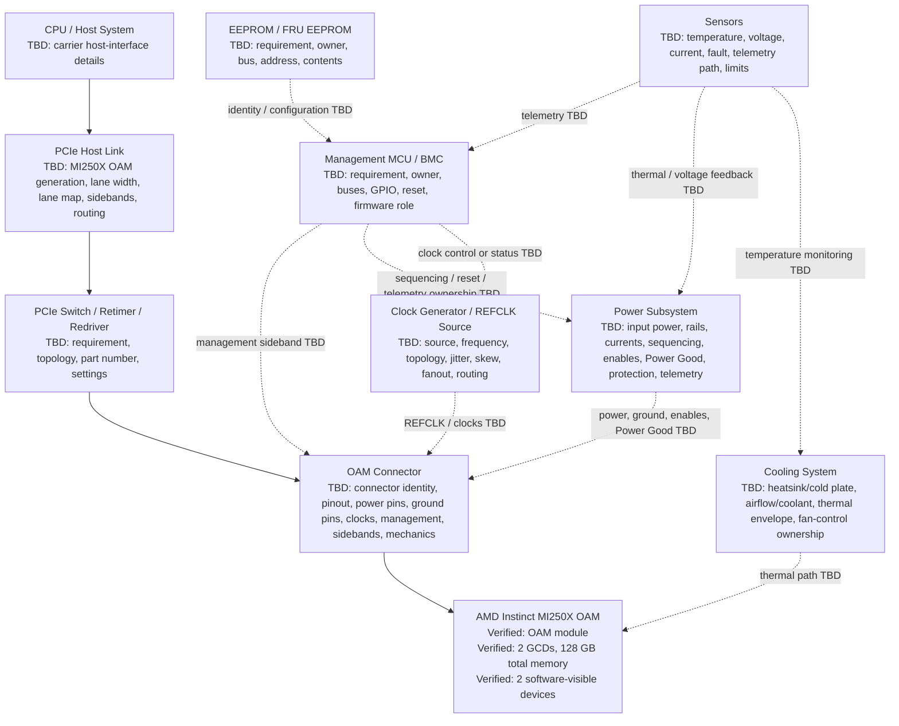

# Block Diagram

## Purpose

Generate a complete high-level system block diagram for the AMD Instinct MI250X OAM carrier effort using only repository-supported information. The diagram is a dependency map, not a schematic. Every unresolved hardware block or interface is labeled `TBD`.

## Mermaid System Block Diagram

## Verified Context

| Block | Status | Repository-supported statement | Sources |
|---|---|---|---|
| MI250X | Verified module context | MI250 and MI250X are OCP Accelerator Modules with two GCDs and 128 GB total memory, presented to software as two devices with separate 64 GB VRAM blocks. | `13_Reference_Docs/ROCm/Overview.md`; `15_Reverse_Engineering/07_Component_ID.md` |
| OAM connector category | Required category, implementation TBD | MI250X is documented as OAM, and the OAM specification is linked as useful for mechanical drawings, connector specification, and power specification. Exact connector identity, pinout, and stack-up are not locally extracted. | `13_Reference_Docs/ROCm/Overview.md`; `02_AMD_Docs/GitHub_Links.rtf`; `15_Reverse_Engineering/01_OAM_Pin_Mapping.md` |
| Host communication | Required category, implementation TBD | A minimal carrier must provide a host-facing communication path for enumeration and ROCm/software use, but MI250X OAM PCIe implementation details are undocumented. | `15_Reverse_Engineering/10_Minimal_Carrier.md`; `17_System_Architecture/03_Minimal_Carrier_Requirements.md`; `15_Reverse_Engineering/05_PCIe.md` |

## TBD Blocks

| Block | Why it is TBD | Sources |
|---|---|---|
| CPU / Host System | The repository provides software-visible host/device context, but not the custom carrier's host electrical connection details. | `13_Reference_Docs/ROCm/Overview.md`; `15_Reverse_Engineering/05_PCIe.md` |
| PCIe Host Link | MI250X OAM generation, lane width, lane mapping, sidebands, reset behavior, signal-integrity limits, and routing constraints are undocumented. | `15_Reverse_Engineering/05_PCIe.md`; `18_Component_Research/08_PCIe_Retimers.md`; `Wanted_Documents.md` |
| PCIe Switch / Retimer / Redriver | Switches, retimers, and redrivers are optional until a verified topology or signal-integrity analysis requires them. | `15_Reverse_Engineering/05_PCIe.md`; `15_Reverse_Engineering/10_Minimal_Carrier.md`; `18_Component_Research/08_PCIe_Retimers.md` |
| Clock Generator / REFCLK Source | REFCLK source, frequency, topology, fanout, jitter, skew, routing, and component requirements are undocumented. | `15_Reverse_Engineering/03_Clock_Tree.md`; `18_Component_Research/03_Clock_Generators.md`; `Wanted_Documents.md` |
| Power Subsystem | Rail names, voltages, currents, input power, sequencing, enables, Power Good, protection, PMBus, and telemetry are undocumented. | `15_Reverse_Engineering/02_Power_Rails.md`; `18_Component_Research/02_Power_Converters.md`; `18_Component_Research/09_Power_Connectors.md` |
| Management MCU / BMC | Carrier-side management controller requirement, bus topology, GPIO, reset, firmware role, and ownership are undocumented. | `15_Reverse_Engineering/04_Management.md`; `18_Component_Research/05_Management_MCU.md`; `17_System_Architecture/03_Minimal_Carrier_Requirements.md` |
| EEPROM / FRU EEPROM | Requirement, owner, bus, address, contents, write protection, and validation role are undocumented. | `15_Reverse_Engineering/04_Management.md`; `18_Component_Research/04_EEPROM_FRU.md`; `15_Reverse_Engineering/10_Minimal_Carrier.md` |
| Sensors | Temperature, voltage, current, fault, telemetry path, sensor location, limits, and ownership are undocumented. | `15_Reverse_Engineering/04_Management.md`; `18_Component_Research/06_Temperature_Sensors.md`; `15_Reverse_Engineering/07_Component_ID.md` |
| Cooling System | Thermal design power, heatsink/cold-plate geometry, airflow/coolant requirements, thermal keepouts, fan control, and sensor placement are undocumented. | `15_Reverse_Engineering/06_Mechanical.md`; `18_Component_Research/07_Fan_Control.md`; `17_System_Architecture/03_Minimal_Carrier_Requirements.md` |

## Design Constraints

- Treat every dashed Mermaid edge as a `TBD` dependency, not a verified schematic net.
- Do not select PCIe switches, retimers, redrivers, clock generators, VRMs, PMBus devices, management controllers, EEPROMs, sensors, fan controllers, or cooling hardware until source documents or verified measurements support them.
- Resolve OAM connector, power, clock, PCIe, management, cooling, and mechanical requirements before schematic capture or PCB layout.

## Sources

- `13_Reference_Docs/ROCm/Overview.md` - Provides MI250/MI250X OAM context, two-GCD/two-device software-visible behavior, MI210 PCIe reference context, and ROCm software context.
- `02_AMD_Docs/GitHub_Links.rtf` - Links the OAM specification and identifies mechanical, connector, and power relevance.
- `Wanted_Documents.md` - Tracks missing Connector Specification, Baseboard Specification, PCIe Routing Guide, REFCLK Guide, PMBus Controller Datasheet, VRM Datasheet, OAM Thermal Guidelines, heatsink photo, and baseboard photo.
- `15_Reverse_Engineering/01_OAM_Pin_Mapping.md` - Documents OAM connector pinout, PCIe lanes, power pins, ground pins, clocks, management, sidebands, reserved pins, and AMD-specific signals as unresolved.
- `15_Reverse_Engineering/02_Power_Rails.md` - Documents power rails, voltages, currents, sequencing, enables, Power Good, PMBus, telemetry, monitoring, protection, and startup order as unresolved.
- `15_Reverse_Engineering/03_Clock_Tree.md` - Documents REFCLK, clock generator, oscillator, PLL, clock buffer, fanout, jitter, skew, routing, and reset interaction as unresolved.
- `15_Reverse_Engineering/04_Management.md` - Documents SMBus, I2C, PMBus, BMC, MCU, EEPROM, FRU EEPROM, sensors, firmware update, and health monitoring as unresolved.
- `15_Reverse_Engineering/05_PCIe.md` - Documents MI250X OAM PCIe generation, lane count, lane routing, REFCLK, PERST#, CLKREQ#, WAKE#, retimers, switches, equalization, and routing constraints as unresolved.
- `15_Reverse_Engineering/06_Mechanical.md` - Documents mechanical, cooling-envelope, heatsink, cold-plate, keepout, connector-placement, and measurement gaps.
- `15_Reverse_Engineering/07_Component_ID.md` - Lists verified module/reference components, low-confidence candidates, and unknown carrier component categories.
- `15_Reverse_Engineering/10_Minimal_Carrier.md` - Defines minimum carrier functions and marks connector, power, clock, PCIe, management, cooling, mechanical, and firmware implementation details as undocumented.
- `17_System_Architecture/02_System_Block_Diagram.md` - Existing architecture-level Mermaid diagram showing host, PCIe, optional switch/retimer, OAM connector, MI250X, power, clock, management, EEPROM, sensors, fan, cooling, and expansion blocks with undocumented details.
- `17_System_Architecture/03_Minimal_Carrier_Requirements.md` - Lists required, optional, and unknown hardware categories and design blockers for the minimal carrier.
- `18_Component_Research/03_Clock_Generators.md` - Related component research for clock generator, oscillator, PLL, clock buffer, REFCLK, jitter, skew, and routing gaps.
- `18_Component_Research/08_PCIe_Retimers.md` - Related component research for PCIe switch, retimer, redriver, equalization, Gen4/Gen5 applicability, lane mapping, and signal-integrity gaps.