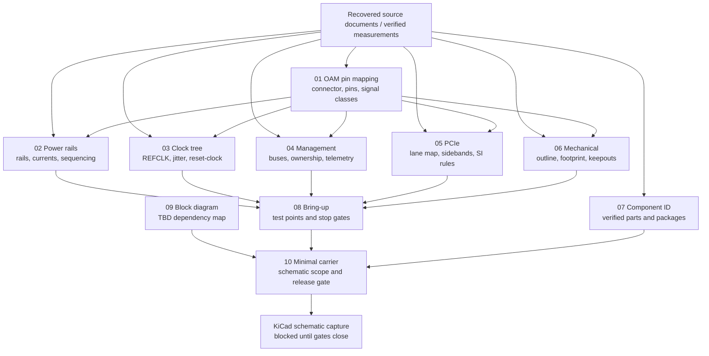

# Reverse Engineering Notebook

## Purpose

This folder is the schematic-preparation notebook for a custom AMD Instinct MI250X OAM carrier board. It consolidates repository-supported reverse-engineering evidence into subsystem references for connector pin mapping, power, clocks, management, PCIe, mechanics, component identification, bring-up, block diagrams, and the smallest one-module carrier concept.

| Rule | Notebook impact | Sources |
|---|---|---|
| Use evidence labels. | Mark facts as `Verified`, `Inferred`, `Candidate`, `TBD`, or `Unknown`; do not promote unresolved information into schematic requirements. | `../README.md`; `AI_PROJECT_CONTEXT.md`; `AI_TASKS.md` |
| Do not invent schematic data. | Leave missing rail values, currents, pin numbers, bus addresses, timing, component part numbers, dimensions, and thermal limits as `Unknown`. | `AI_PROJECT_CONTEXT.md`; `09_AI_Notes/10_Design_Checklist.md`; `15_Reverse_Engineering/10_Minimal_Carrier.md` |
| Keep system planning separate from MI250X/OAM requirements. | Treat host-platform, CRPS, cooling, and future-expansion targets as planning context unless a source maps them to one MI250X OAM carrier requirement. | `17_System_Architecture/03_Minimal_Carrier_Requirements.md`; `20_System_BOM/Power.md`; `20_System_BOM/GPU_Subsystem.md` |

## Notebook Map

| File | Role in schematic preparation | Primary schematic output if resolved | Related notebooks |
|---|---|---|---|
| `01_OAM_Pin_Mapping.md` | Connector and signal-classification authority. | OAM connector symbol, pin map, signal classes, reserved/no-connect handling. | `02_Power_Rails.md`; `03_Clock_Tree.md`; `04_Management.md`; `05_PCIe.md`; `06_Mechanical.md`; `10_Minimal_Carrier.md` |
| `02_Power_Rails.md` | Power, ground, sequencing, enables, Power Good, PMBus, telemetry, monitoring, and protection reference. | Rail table, regulator requirements, current limits, power-good/reset gates, protection requirements. | `01_OAM_Pin_Mapping.md`; `04_Management.md`; `08_Bringup.md`; `10_Minimal_Carrier.md` |
| `03_Clock_Tree.md` | REFCLK, oscillator, clock generator, PLL, buffer, fanout, jitter, skew, and reset-clock reference. | Clock tree, clock-component requirements, routing constraints, clock-valid gates. | `05_PCIe.md`; `02_Power_Rails.md`; `08_Bringup.md`; `09_Block_Diagram.md` |
| `04_Management.md` | SMBus, I2C, PMBus, BMC/MCU, EEPROM/FRU, sensors, firmware, and health-monitoring reference. | Management bus map, ownership table, controller requirements, telemetry and firmware interfaces. | `02_Power_Rails.md`; `07_Component_ID.md`; `08_Bringup.md`; `10_Minimal_Carrier.md` |
| `05_PCIe.md` | PCIe generation, lane count, lane routing, REFCLK, sidebands, polarity, switch/retimer/redriver, equalization, and routing reference. | Host-link topology, PCIe lane map, sideband nets, high-speed routing constraints. | `01_OAM_Pin_Mapping.md`; `03_Clock_Tree.md`; `08_Bringup.md`; `10_Minimal_Carrier.md` |
| `06_Mechanical.md` | Dimensions, connector locations, mounting, PCB thickness, cooling envelope, weight, keepouts, connector height, and tolerances reference. | Board outline, footprint placement, keepout layers, mounting and cooling constraints. | `01_OAM_Pin_Mapping.md`; `07_Component_ID.md`; `09_Block_Diagram.md`; `10_Minimal_Carrier.md` |
| `07_Component_ID.md` | Component inventory and confidence-level record. | Candidate-to-verified component transition log for BOM, symbols, footprints, and datasheets. | `02_Power_Rails.md`; `03_Clock_Tree.md`; `04_Management.md`; `05_PCIe.md`; `06_Mechanical.md` |
| `08_Bringup.md` | Gated lab procedure and validation checklist. | Test-point plan, bring-up evidence log, stop conditions, debug and recovery flow. | `02_Power_Rails.md`; `03_Clock_Tree.md`; `04_Management.md`; `05_PCIe.md`; `10_Minimal_Carrier.md` |
| `09_Block_Diagram.md` | High-level dependency diagram. | System block diagram with every unresolved block labeled `TBD`. | All subsystem notebooks; `17_System_Architecture/02_System_Block_Diagram.md` |
| `10_Minimal_Carrier.md` | One-module minimum carrier definition and release gate. | Schematic scope, required/optional block decision, KiCad readiness checklist. | All subsystem notebooks; `17_System_Architecture/03_Minimal_Carrier_Requirements.md` |

## KiCad Dependency Diagram

This Mermaid diagram is a dependency map, not a schematic. A block may enter KiCad only after the source notebook marks its implementation details verified.

## KiCad Schematic Capture Blockers

| Subsystem | Remaining `Unknown` that blocks schematic capture | Authority file | Required result before KiCad work |
|---|---|---|---|
| OAM connector | Connector manufacturer, family, part number, pin count, pinout, pin numbering, signal names, power pins, ground pins, clock pins, sideband pins, management pins, reserved pins, no-connect pins, mating height, stack-up, footprint, current rating, and AMD-specific signals. | `01_OAM_Pin_Mapping.md`; `06_Mechanical.md` | Verified connector source or measurements with full electrical and mechanical mapping. |
| Power | MI250X/OAM rail names, voltages, currents, input power, connector ratings, power and ground current sharing, sequencing, enables, Power Good, PMBus, monitoring, protection, shutdown, and fault behavior. | `02_Power_Rails.md`; `04_Management.md` | Source-backed rail and sequencing table with measurement points and limits. |
| Clock and reset | REFCLK frequency, source ownership, topology, electrical standard, connector pins, jitter, skew, routing, clock components, reset names, polarity, timing, and Power Good relationship. | `03_Clock_Tree.md`; `05_PCIe.md` | Verified clock tree and reset timing table tied to PCIe enumeration requirements. |
| PCIe | MI250X OAM PCIe generation, lane width, lane order, TX/RX direction, polarity, sidebands, REFCLK pins, direct/switch/retimer/redriver topology, equalization, AC-coupling, impedance, length matching, loss budget, and compliance method. | `05_PCIe.md`; `03_Clock_Tree.md` | Verified host-link topology, lane map, sideband table, and routing constraints. |
| Management and telemetry | SMBus/I2C/PMBus presence, topology, addresses, bus owner, pullups, voltage levels, controller requirement, EEPROM/FRU role, firmware-update path, sensors, fan-control ownership, fault alerts, and health criteria. | `04_Management.md`; `07_Component_ID.md`; `08_Bringup.md` | Verified ownership and bus map, or verified absence of each management function. |
| Mechanical and cooling | Module dimensions, connector coordinates, pin-1 datum, mounting holes, board outline, PCB thickness, keepouts, connector height, standoff height, tolerance stack, cooling method, TDP, thermal limits, heatsink/cold-plate geometry, airflow/coolant requirements, mounting force, and weight. | `06_Mechanical.md`; `10_Minimal_Carrier.md` | Verified mechanical drawing or measured dataset with provenance and thermal/cooling constraints. |
| Components and BOM | Actual connector, regulators, power stages, PMBus devices, clock parts, MCU/BMC, EEPROM/FRU, sensors, fan controller, PCIe switch/retimer/redriver, cooling hardware, PCB stack-up, retention hardware, and debug/test components. | `07_Component_ID.md`; `18_Component_Research/10_BOM.md` | Manufacturer, part number, package, datasheet, footprint, confidence level, and source for each part used in KiCad. |
| Bring-up and validation | Safe power-up order, pass/fail limits, current limits, clock limits, reset timing, bus addresses, firmware commands, health checks, thermal limits, stress criteria, debug recovery, and evidence logging. | `08_Bringup.md`; `10_Minimal_Carrier.md` | Numbered, source-backed validation procedure with test points and stop conditions. |

## Consistency Checks

| Check | Folder-wide decision | References |
|---|---|---|
| MI210 vs MI250X | MI210 PCIe 4.0 x16 facts are reference context only and must not be used as MI250X OAM pinout or routing evidence. | `01_OAM_Pin_Mapping.md`; `05_PCIe.md`; `07_Component_ID.md` |
| MP2975 | `MP2975` remains a low-confidence candidate research lead, not a verified carrier component or rail/PMBus source. | `02_Power_Rails.md`; `04_Management.md`; `07_Component_ID.md` |
| Molex Mirror Mezz | Mirror Mezz remains a candidate connector reference only; it is not confirmed as the MI250X OAM connector. | `01_OAM_Pin_Mapping.md`; `06_Mechanical.md`; `07_Component_ID.md` |
| PCIe switches, retimers, redrivers | These are optional until topology and signal-integrity evidence proves they are required. | `05_PCIe.md`; `07_Component_ID.md`; `10_Minimal_Carrier.md` |
| Management MCU, BMC, EEPROM, sensors, fan controller | These are placeholders or optional blocks until ownership, pins, buses, addresses, and functions are verified. | `04_Management.md`; `07_Component_ID.md`; `10_Minimal_Carrier.md` |
| System-BOM power and cooling goals | CRPS, 12V distribution, front-to-rear airflow, and future liquid cooling are planning context, not verified one-module MI250X OAM electrical or thermal requirements. | `02_Power_Rails.md`; `06_Mechanical.md`; `10_Minimal_Carrier.md`; `20_System_BOM/Power.md`; `20_System_BOM/Cooling.md` |
| Future expansion | Multi-module goals must not add hardware to the smallest one-module carrier unless one-module evidence requires it. | `10_Minimal_Carrier.md`; `17_System_Architecture/04_Future_Expansion.md` |

## Source Priority

| Priority | Source needed | Why it matters | References |
|---|---|---|---|
| High | Connector Specification, Baseboard Specification, and extracted OAM connector sections. | Blocks connector symbol, footprint, pinout, mechanical stack-up, power/ground, PCIe, clock, management, and reserved-pin handling. | `Wanted_Documents.md`; `01_OAM_Pin_Mapping.md`; `06_Mechanical.md` |
| High | Power, VRM, PMBus, and sequencing documentation. | Blocks rail generation, protection, current sizing, telemetry, enables, Power Good, and safe bring-up. | `02_Power_Rails.md`; `04_Management.md`; `08_Bringup.md` |
| High | PCIe Routing Guide and REFCLK Guide. | Blocks lane routing, sidebands, clock topology, reset behavior, signal-integrity constraints, and compliance. | `03_Clock_Tree.md`; `05_PCIe.md`; `Wanted_Documents.md` |
| High | Mechanical Specification, OAM Thermal Guidelines, and usable photos/drawings. | Blocks board outline, connector placement, mounting, keepouts, cooling, and sustained operation. | `06_Mechanical.md`; `10_Minimal_Carrier.md`; `Wanted_Documents.md` |
| Medium | Firmware, health-check, system-validation, and GPU-management references. | Blocks executable validation, firmware update/recovery, health monitoring, and release criteria. | `04_Management.md`; `08_Bringup.md`; `13_Reference_Docs/Reference_Index.rtf` |
| Medium | Repair or replace invalid local PDFs and add missing image files with provenance. | Blocks component identification and any future use of visual or PDF-derived evidence. | `07_Component_ID.md`; `09_AI_Notes/09_Unknowns.md`; `Wanted_Documents.md` |

## Sources

| Source | Use in this folder |
|---|---|
| `../README.md` | Establishes public-evidence workflow and rule to track undocumented behavior instead of assuming it. |
| `AI_PROJECT_CONTEXT.md` | Defines evidence labels, project goal, and rule against invented hardware requirements. |
| `AI_TASKS.md` | Lists reverse-engineering, schematic, layout, bring-up, validation, and unknown-resolution tasks. |
| `Wanted_Documents.md` | Tracks found and missing OAM, connector, baseboard, mechanical, PCIe, REFCLK, PMBus, VRM, thermal, and photo evidence. |
| `09_AI_Notes/10_Design_Checklist.md` | States that schematic capture and PCB layout must wait for connector, PCIe/REFCLK, power, management, mechanical, baseboard, and high-speed constraints. |
| `17_System_Architecture/03_Minimal_Carrier_Requirements.md` | Main architecture reference for required, optional, unknown, and risk categories for the minimum carrier. |
| `18_Component_Research/10_BOM.md` | Living BOM planning source for verified, candidate, optional, and unknown components. |
