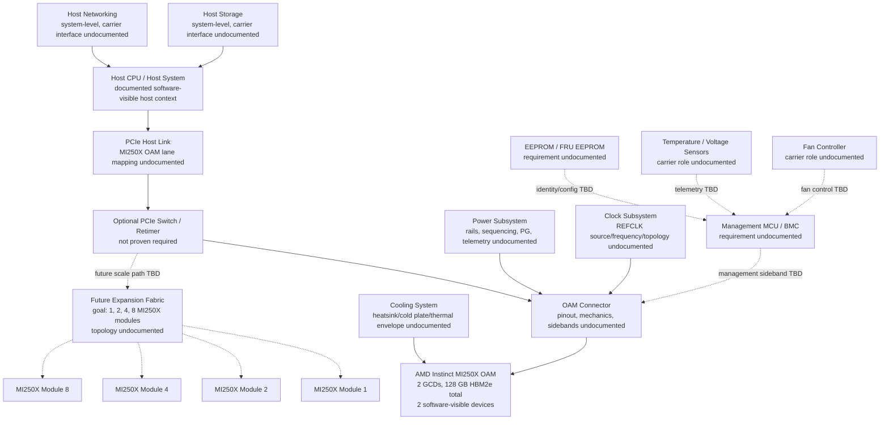

# System Block Diagram

## Purpose

This document describes the high-level system architecture for an Open MI250X Carrier design. It shows the intended host-to-accelerator path, required support subsystems, and future expansion direction toward eight MI250X modules. Blocks marked as undocumented are design areas identified by the repository, not verified electrical interfaces.

## Mermaid Diagram

## Subsystem Explanation

- **Host CPU / Host System:** The readable ROCm overview describes host/device memory behavior and shows MI200 software inspection through `rocminfo`. It does not define the custom carrier's host electrical interface. Sources: `13_Reference_Docs/ROCm/Overview.md`, `15_Reverse_Engineering/09_Block_Diagram.md`.
- **PCIe:** PCIe is the intended host-link category, and system goals list PCIe Gen4, but MI250X OAM lane count, lane mapping, REFCLK, resets, sidebands, and routing rules remain undocumented. Sources: `17_System_Architecture/01_System_Goals.rtf`, `15_Reverse_Engineering/05_PCIe.md`, `Wanted_Documents.md`.
- **Optional PCIe Switch / Retimer:** Include as an expansion/planning block only. The repo explicitly says switches and retimers are undocumented and not proven required. Sources: `15_Reverse_Engineering/05_PCIe.md`, `15_Reverse_Engineering/10_Minimal_Carrier.md`.
- **OAM Connector:** MI250X is documented as an OCP Accelerator Module, and the OAM spec is linked as relevant to mechanical, connector, and power specification. Exact connector type, pinout, pin count, mating height, and AMD-specific signals are not locally documented. Sources: `13_Reference_Docs/ROCm/Overview.md`, `02_AMD_Docs/GitHub_Links.rtf`, `15_Reverse_Engineering/01_OAM_Pin_Mapping.md`.
- **MI250X:** Publicly documented as an OAM with two GCDs and 128 GB total memory, exposed as two software-visible devices with separate 64 GB VRAM blocks. Source: `13_Reference_Docs/ROCm/Overview.md`.
- **Power / Clock / Reset:** These are required design functions, but rails, sequencing, Power Good, REFCLK frequency/topology, and reset timing are undocumented. Sources: `15_Reverse_Engineering/02_Power_Rails.md`, `15_Reverse_Engineering/03_Clock_Tree.md`, `15_Reverse_Engineering/08_Bringup.md`.
- **Management MCU, EEPROM, Sensors, Fan Controller:** Firmware, health, validation, and GPU management references are indexed, but carrier-side MCU, EEPROM/FRU, sensors, fan control, PMBus, SMBus/I2C, and firmware wiring are undocumented. Sources: `13_Reference_Docs/Reference_Index.rtf`, `15_Reverse_Engineering/04_Management.md`, `15_Reverse_Engineering/07_Component_ID.md`.
- **Cooling:** System goals call for replaceable cooling, and cooling references are indexed, but thermal guidelines, heatsink/baseboard photos, cold plate details, fan ownership, and thermal envelope are not verified locally. Sources: `17_System_Architecture/01_System_Goals.rtf`, `13_Reference_Docs/Reference_Index.rtf`, `15_Reverse_Engineering/06_Mechanical.md`.
- **Storage / Networking:** Shown as host-system context only. The repository does not document storage or networking as MI250X carrier-board interfaces.
- **Eight-MI250X Expansion:** The system architecture goal is scalability from one GPU prototype to an eight-GPU compute platform, with long-term goals of 1, 2, 4, and 8 MI250X modules. The electrical topology for eight modules is not documented. Sources: `17_System_Architecture/README.md`, `17_System_Architecture/01_System_Goals.rtf`.

## Design Constraints

- Do not treat undocumented dashed connections as verified schematic nets.
- Do not select PCIe switches, retimers, clock buffers, VRMs, management controllers, EEPROMs, fan controllers, or cooling hardware until source documents or verified measurements support the choice.
- Resolve connector, power, clock, PCIe, management, cooling, and mechanical requirements before schematic capture.